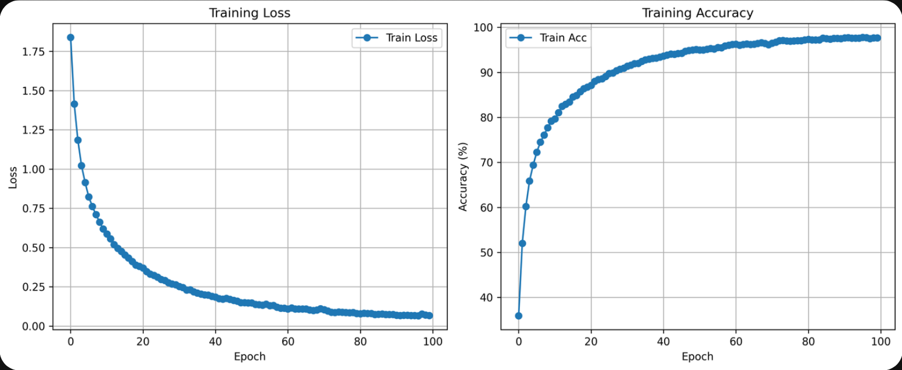
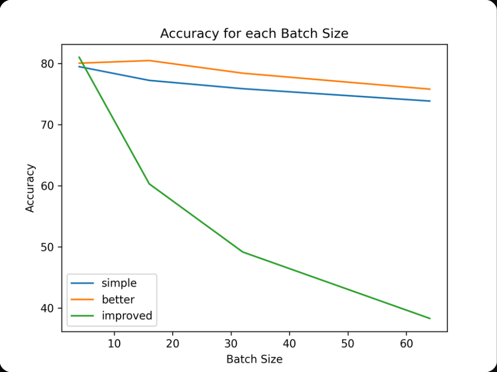
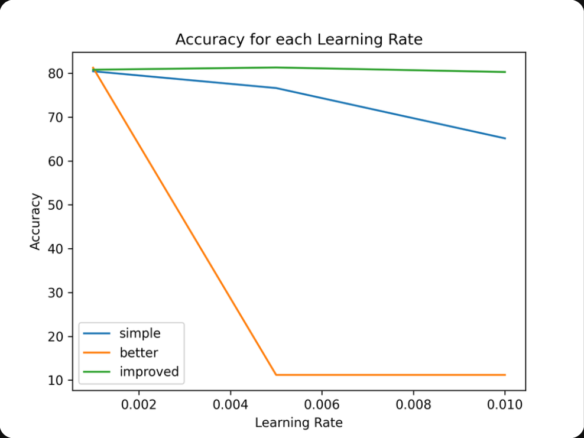
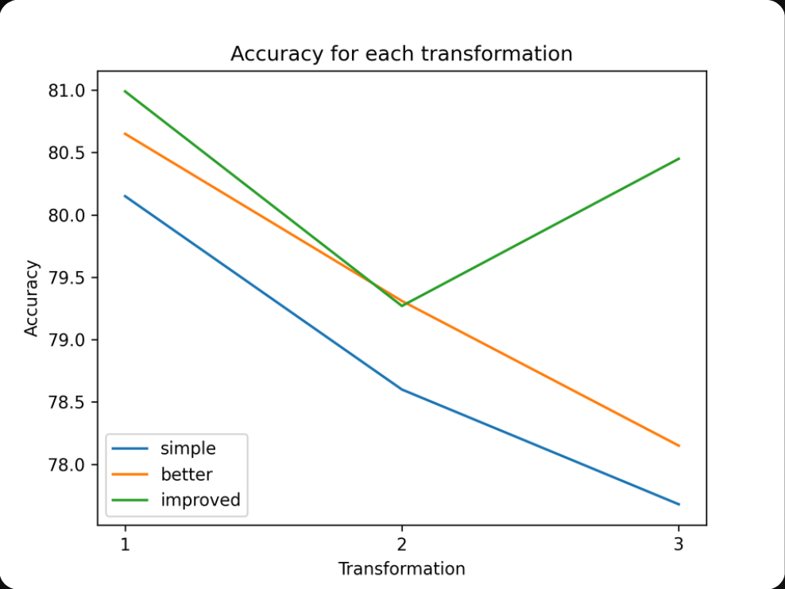
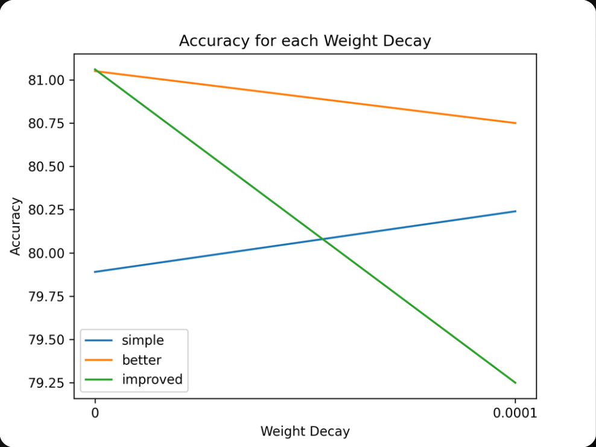
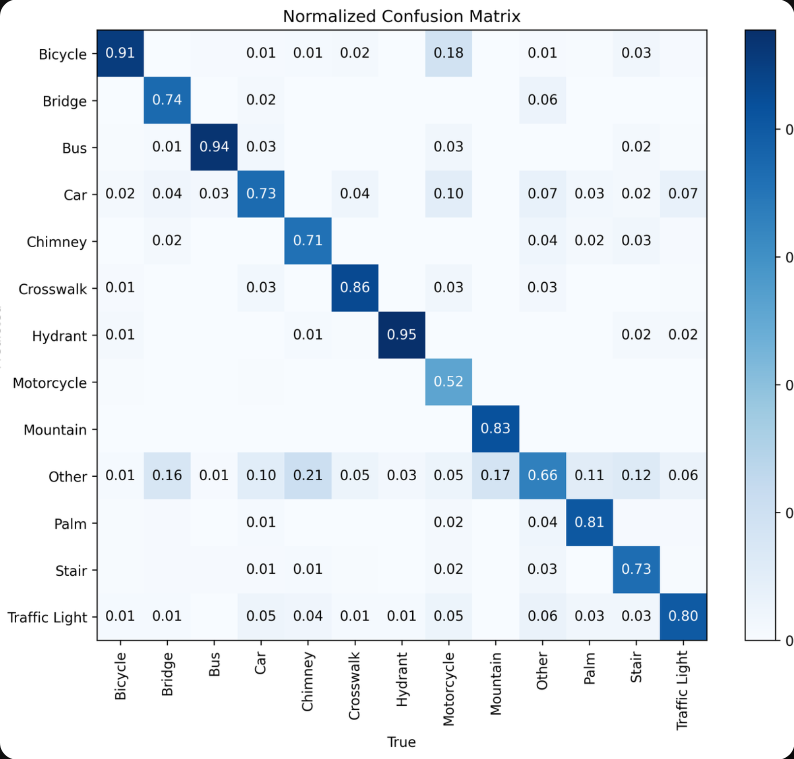
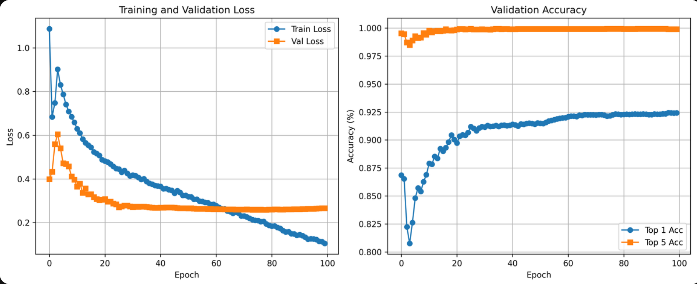
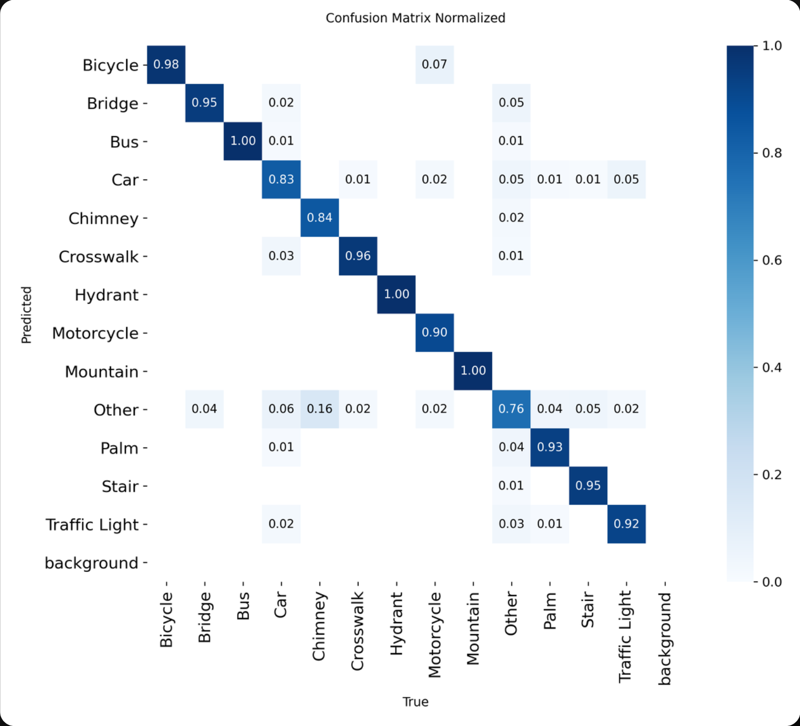

# 🤖 Is reCAPTCHAv2 Safe?

A research project that investigates the **security of Google reCAPTCHAv2** by training image classification models (CNNs and YOLO) to solve its image challenges — evaluating how vulnerable the popular "I'm not a robot" test is to automated attacks.

This was developed as an academic research project at **UFABC (Universidade Federal do ABC)**.

---

## 🎯 Motivation

Google reCAPTCHAv2 presents users with image challenges — "Select all images with traffic lights", "Click all squares with buses" — as a way to distinguish humans from bots. But how robust are these challenges against modern deep learning?

This project builds and evaluates two families of models to answer that question:

1. **Custom CNNs** (PyTorch) — trained from scratch with varying architectures, augmentation strategies, learning rates, and batch sizes.
2. **YOLO classifiers** (Ultralytics) — fine-tuned YOLOv8 and YOLO11 models from Nano to Extra Large variants.

Both model families are evaluated on four publicly available reCAPTCHA image datasets, enabling a rigorous comparison of automated solving accuracy.

---

## 🏗️ Architecture

```
is-reCAPTCHAv2-safe/
├── src/
│   ├── pytorch.py              # CNN training pipeline (architecture, training loop, evaluation)
│   ├── yolo.ipynb              # YOLO fine-tuning notebook (YOLOv8 & YOLO11)
│   └── utils/
│       ├── dataset_download.py # Automated downloader for all 4 datasets
│       └── load_datasets.py    # Merges datasets, deduplicates, and exports to Parquet
├── docs/                       # Result graphs and figures
├── datasets/                   # Raw datasets (populated at runtime)
└── pyproject.toml              # Project metadata and dependencies (managed by uv)
```

### Data Pipeline

Raw image datasets are downloaded and merged into a unified Parquet file, then reorganized into k-fold cross-validation splits (HDF5 for CNN, folder structure for YOLO):

```
dataset_fold{0-4}/
├── labels.txt       # Class labels and split assignments
├── train.h5         # Training set in HDF5 format (for CNN)
├── val.h5           # Validation set in HDF5 format (for CNN)
├── train/           # Training images organized by class (for YOLO)
│   ├── Bicycle/
│   ├── Bridge/
│   ├── Bus/
│   ├── Car/
│   ├── Crosswalk/
│   ├── Hydrant/
│   ├── Motorcycle/
│   ├── Mountain/
│   ├── Palm/
│   ├── Stair/
│   ├── Traffic Light/
│   └── ...
└── val/             # Validation images organized by class (for YOLO)
```

---

## 📦 Datasets

The project aggregates four publicly available reCAPTCHA image datasets, downloaded automatically at runtime:

| Source | Host | Description |
|--------|------|-------------|
| `cry2003/google-recaptcha-v2-images` | Kaggle | Google reCAPTCHA v2 challenge images |
| `mikhailma/test-dataset` | Kaggle | Google Recaptcha V2 Images Dataset |
| `AdityaJain1030/recaptcha-dataset` | GitHub | reCAPTCHA challenge dataset (Train + Validation) |
| `nobodyPerfecZ/recaptchav2-29k` | GitHub | ~29k reCAPTCHA v2 images |

Duplicates are removed by filename after merging. The `TLight` label is normalized to `Traffic Light` for consistency.

---

## 🔬 Models

### Model 1 — Custom CNN (PyTorch)

Three CNN architectures are implemented in [`pytorch.py`](src/pytorch.py), all trained from scratch on 128×128 inputs:

| Architecture | Key Features |
|---|---|
| **SimpleCNN** | 2 conv blocks (32→64 channels), AvgPool, 2 FC layers |
| **BetterCNN** | 3 conv blocks (32→64→128 channels), MaxPool, 2 FC layers |
| **BetterImprovedCNN** | 3 conv blocks + BatchNorm, Dropout(0.25), AdaptiveAvgPool2d |

Training runs a hyperparameter sweep across:
- **Data augmentation**: flip + rotation / color jitter + affine / Gaussian blur combinations
- **Learning rates**: `0.01`, `0.005`, `0.001`
- **Weight decay**: `0` / `1e-4`
- **Batch sizes**: `4`, `16`, `32`, `64`

### Model 2 — YOLO Classifier (Ultralytics)

Fine-tuned classification models from the Ultralytics suite, supporting ten model variants across two generations:

| Generation | Variants |
|---|---|
| **YOLOv8** | Nano · Small · Medium · Large · Extra Large |
| **YOLO11** | Nano · Small · Medium · Large · Extra Large |

Training is conducted in [`yolo.ipynb`](src/yolo.ipynb), which is also [available on Google Colab](https://colab.research.google.com/drive/1wqS-FyvIli-cfks-cQqtvsxJj_L3hhMb).

---

## 📊 Results

### CNN Results

The best CNN runs reached **~81% validation accuracy** across the 13-class reCAPTCHA challenge. Below are the training dynamics and a hyperparameter sensitivity analysis.

**Training curves (best run):**



**Hyperparameter sensitivity:**

| Hyperparameter | Key Finding |
|---|---|
| **Batch size** | Small batches (4) consistently outperform larger ones; all models degrade with batch size 64 |
| **Learning rate** | `lr=0.001` is optimal for all models; `lr=0.005+` causes divergence in BetterCNN |
| **Transformation** | Augmentation #1 (flip + rotation) works best; heavier augmentation hurts most models |
| **Weight decay** | No weight decay (`0`) performs better or on par across all architectures |

<table>
  <tr>
    <td></td>
    <td></td>
  </tr>
  <tr>
    <td></td>
    <td></td>
  </tr>
</table>

**CNN Normalized Confusion Matrix (best run):**



Most classes are well-separated. The highest confusion is in the "Other" catch-all class and "Motorcycle", which are harder to distinguish from visually similar categories.

---

### YOLO Results

YOLO classifiers significantly outperform the custom CNNs, reaching **~92% top-1** and **~99.5% top-5** validation accuracy, converging stably within 100 epochs.

**Training and validation curves:**



**YOLO Normalized Confusion Matrix:**



Nearly all classes achieve ≥90% precision, with Bus and Hydrant reaching **100%**. The "Other" background class remains the hardest to classify, consistent with CNN results.

### Summary

| Model | Val Accuracy (Top-1) | Notes |
|---|---|---|
| SimpleCNN (best) | ~80% | Small batch, lr=0.001, augment #1 |
| BetterCNN (best) | ~81% | Small batch, lr=0.001, no weight decay |
| BetterImprovedCNN (best) | ~81% | Degrades sharply with large batches |
| **YOLO (best)** | **~92%** | Fine-tuned YOLOv8/YOLO11, top-5 ≈ 99.5% |

The gap between custom CNNs (~81%) and fine-tuned YOLO (~92%) highlights the power of transfer learning from large-scale pretrained weights, even for a task as specialized as CAPTCHA solving.

---

## 🚀 Getting Started

### Requirements

- Python 3.13+
- [`uv`](https://docs.astral.sh/uv/) (package manager)
- GPU with CUDA or Apple Silicon (MPS) — optional but recommended

### Installation

1. Clone the repository:
```bash
git clone https://github.com/caiostoduto/is-reCAPTCHAv2-safe.git
cd is-reCAPTCHAv2-safe
```

2. Install dependencies with `uv`:
```bash
uv sync
```

### Download Datasets

Datasets are downloaded automatically when you run the training scripts. Alternatively, trigger the download manually:

```python
from src.utils.dataset_download import DatasetDownloader

downloader = DatasetDownloader("datasets")
downloader.download_all()
```

> **Note:** Kaggle datasets require a valid Kaggle API token (`~/.kaggle/kaggle.json`).

### Running the CNN

```bash
cd src
uv run python pytorch.py
```

This sweeps over all hyperparameter combinations and saves results to `src/is_recaptchav2_safe/pytorch/run_<N>/`. Each run produces:
- `results.csv` — per-epoch loss, accuracy, and learning rate
- `training_plots.png` — loss and accuracy curves
- `confusion_matrix.png` — raw confusion matrix
- `confusion_matrix_normalized.png` — normalized confusion matrix
- `cnn.pth` — saved model weights

### Running YOLO

Open [`src/yolo.ipynb`](src/yolo.ipynb) in JupyterLab and execute the cells in order, or open the notebook directly in [Google Colab](https://colab.research.google.com/drive/1wqS-FyvIli-cfks-cQqtvsxJj_L3hhMb).

---

## 🛠️ Dependencies

| Package | Purpose |
|---|---|
| `torch` + `torchvision` | CNN training and image transforms |
| `ultralytics` | YOLOv8 / YOLO11 fine-tuning |
| `h5py` | Efficient HDF5 dataset storage |
| `scikit-learn` | Confusion matrix and evaluation metrics |
| `pandas` + `pyarrow` | Dataset aggregation and Parquet I/O |
| `timm` | Pretrained model backbones |
| `requests` | Automated dataset downloading |

---

## 📄 License

This project is licensed under the [GNU General Public License v3.0](LICENSE).